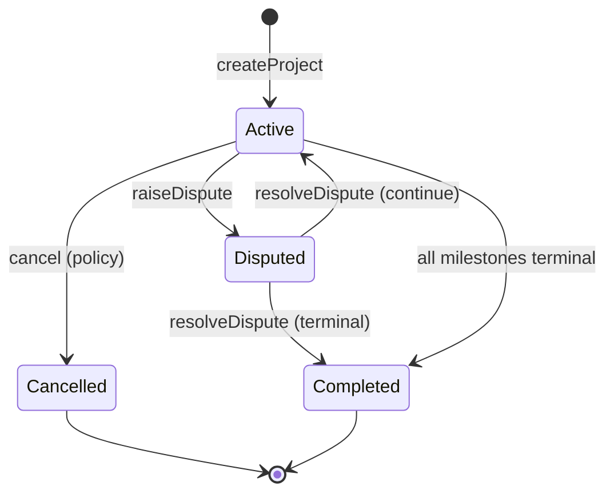
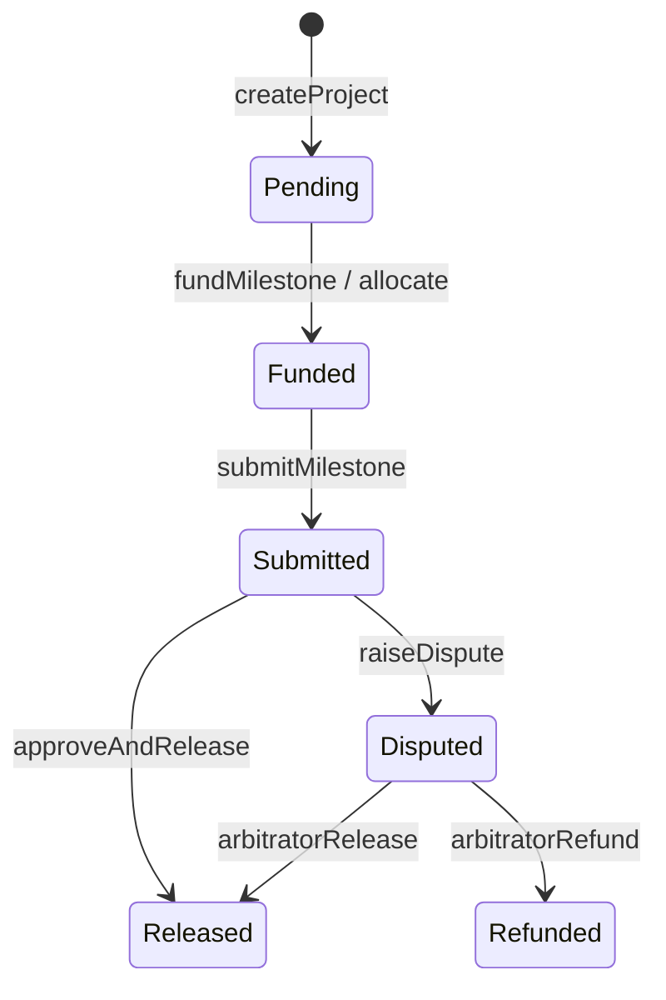

# EscrowFlow — smart contract design (specification)

This document is the **authoritative design** for the on-chain escrow system before full Solidity implementation. It aligns with the product direction: **one registry-style contract** managing many **projects**, each with **milestones**, **ERC20 funding**, **client approval**, and **arbitrated disputes**.

---

## 1. Goals and non-goals

**Goals**

- Single deployable **core contract** (plus standard **ERC20** tokens such as USDC).
- **Multiple projects** in one contract: clear IDs, enumerable or queryable where needed.
- **Milestone-based** release: fund → submit → approve → release (per milestone).
- **Disputes** raisable by client or freelancer; **arbitrator** (protocol role) resolves.
- **Rich indexing**: emit **events** for every material state change with enough fields for subgraphs / off-chain sync.
- **Defense in depth**: reentrancy protection, pull or strict checks-effects-interactions, minimal trust in URIs.

**Non-goals (v1)**

- Native ETH escrow (only **ERC20**).
- Automatic slashing / complex multi-sig clients (can be added later).
- Upgradeable proxies (document assumes **non-upgradeable** v1; can revisit).
- On-chain encryption or private deliverables (use **IPFS** + hashes / URIs only).

---

## 2. Architecture

### 2.1 Single registry contract

**`EscrowFlowRegistry`** (name TBD) holds:

- Global configuration (e.g. **fee recipient**, optional **protocol fee bps**, **paused** flag).
- **AccessControl** roles: `DEFAULT_ADMIN_ROLE`, `ARBITRATOR_ROLE`, optionally `PAUSER_ROLE`.
- Monotonic **`projectId`** counter and storage mapping `projectId → Project`.
- Per project: **milestones** array (or mapping `milestoneIndex → Milestone` with `milestoneCount`).

External integrations call **one contract address** for create, fund, submit, approve, dispute, and resolve.

### 2.2 Token model

- Each project binds **`token`** (ERC20) at creation **immutable** for that project.
- All amounts are in **token smallest units** (e.g. 6 decimals for USDC-like tokens).
- **Transfers**: use **`SafeERC20`** from OpenZeppelin; prefer **`transferFrom` (client → contract)** for funding and **`transfer` (contract → freelancer)** for releases/refunds as implemented with **nonReentrant** guards.

---

## 3. Data structures (on-chain)

### 3.1 Project

| Field            | Type        | Description |
|-----------------|-------------|-------------|
| `client`        | `address`   | Payer; funds and approves milestones. |
| `freelancer`    | `address`   | Recipient of released funds; submits work. |
| `token`         | `address`   | ERC20 used for this project (immutable). |
| `totalAmount`   | `uint256`   | Sum of milestone amounts (set at creation). |
| `fundedAmount`  | `uint256`   | Cumulative tokens pulled from client into escrow for this project. |
| `releasedAmount`| `uint256`   | Cumulative tokens sent to freelancer (and optionally protocol fees). |
| `metadataURI`   | `string`    | Pointer to off-chain / IPFS JSON for title, description, etc. |
| `status`        | `enum`      | High-level project lifecycle (see §5). |
| `milestoneCount`| `uint256`   | Number of milestones. |
| `dispute`       | `struct`    | Optional flattened dispute state (active flag, raisedBy, openedAt, reason URI) or separate mapping keyed by project. |

**Notes**

- `totalAmount` should equal **sum of milestone amounts** at creation; enforce in `createProject`.
- `fundedAmount - releasedAmount` (minus amounts locked in disputes, see invariants) represents **custody** held by the contract for the project.

### 3.2 Milestone

| Field           | Type      | Description |
|-----------------|-----------|-------------|
| `amount`        | `uint256` | Gross milestone payment (in token units). |
| `deadline`      | `uint64`  | Unix timestamp; used for timeouts / dispute policy (exact rules in §5). |
| `status`        | `enum`    | Milestone lifecycle. |
| `submissionURI` | `string`  | IPFS / https pointer to deliverable metadata (hash in JSON recommended). |

Optional gas optimizations (implementation detail): hash submission on-chain and store `bytes32 submissionHash` instead of full string; v1 may keep **URI** for simplicity and mirror hash off-chain in events.

### 3.3 Enums (proposed)

**`ProjectStatus`**

- `Draft` — optional; if unused, first state is `Active`.
- `Active` — normal operation; funding and milestones can progress.
- `Disputed` — at least one open dispute affecting payout policy (see §5).
- `Completed` — all milestones **Released** or **Refunded** per policy; no further funding.
- `Cancelled` — project voided before full funding or by admin policy; refunds per rules.

**`MilestoneStatus`**

- `Pending` — not yet funded for this milestone’s turn in the flow **or** waiting for client to fund tranche (see two patterns below).
- `Funded` — escrow holds funds allocated to this milestone (or project-level pool allocated).
- `Submitted` — freelancer posted submission URI; awaiting client action.
- `Approved` — client approved; ready for **release** (may be same tx as release).
- `Released` — funds moved to freelancer (and fees).
- `Refunded` — funds returned to client (milestone or proportional).
- `Disputed` — tied to active dispute (optional duplicate of project-level flag).

**Design choice (to pick at implementation):**

- **A. Per-milestone funding**: client calls `fundMilestone(projectId, milestoneIndex)` up to `amount`; `fundedAmount` increments; milestone goes `Pending → Funded`.
- **B. Project-level funding**: client calls `fundProject(projectId, amount)`; `fundedAmount` increases; milestones consume from pool when moved to `Funded`.

Specification **requires** tracking **`fundedAmount`** and **`releasedAmount`** at project level either way; milestone `amount` must not be exceeded cumulatively.

---

## 4. Actors and access control

### 4.1 Global roles (OpenZeppelin `AccessControl`)

| Role               | Purpose |
|--------------------|---------|
| `DEFAULT_ADMIN_ROLE` | Configure fees, pause, grant/revoke arbitrators, emergency actions. |
| `ARBITRATOR_ROLE`  | Resolve disputes; may trigger **refund** or **release** outcomes. |
| `PAUSER_ROLE`      | Optional; pause deposits and state-changing ops except withdrawals defined by policy. |

### 4.2 Per-project parties (no separate role IDs)

- **`client`**, **`freelancer`**: stored per `projectId`; only these addresses may call party-specific functions (`fund*`, `approveMilestone`, `submitMilestone`, `raiseDispute` subject to status).

### 4.3 Function access matrix (summary)

| Action              | Caller                          |
|---------------------|---------------------------------|
| Create project      | Any approved factory policy **or** client (design: **client** creates and sets freelancer + milestones). |
| Fund                | `client`                        |
| Submit milestone    | `freelancer`                    |
| Approve / reject    | `client` (reject may go to dispute or refund path) |
| Release payout      | `client` (after approve) **or** contract internal after approve; **or** `ARBITRATOR` on win |
| Raise dispute       | `client` or `freelancer`        |
| Resolve dispute     | `ARBITRATOR_ROLE` only          |
| Pause / config      | `DEFAULT_ADMIN` / `PAUSER`      |

**Recommended v1**: **client** creates the project (defines freelancer, token, milestones, metadata URI) so the client is clearly the payer and author of terms on-chain.

---

## 5. State machines and allowed transitions

### 5.1 Project

**Allowed transitions**

- `Active → Disputed`: when either party calls `raiseDispute` while project not already in terminal state.
- `Disputed → Active`: arbitrator resolves with outcome that allows work to continue (e.g. reject submission, freelancer may resubmit — milestone returns from `Disputed`/`Submitted` to a prior state per policy).
- `Disputed → Completed`: arbitrator orders final payout or full refund and no milestones remain open.
- `Active → Completed`: all milestones `Released` or `Refunded` and `fundedAmount == releasedAmount + refundedAmount` (invariant §7).
- `Active → Cancelled`: only before significant funding or via admin rule (document exact rule in code comments).

### 5.2 Milestone (happy path)

**Reject path (v1)**

- Client may **`rejectSubmission`**: either moves milestone back to **`Funded`** (freelancer resubmits) or opens **`Disputed`** automatically — **pick one** in implementation; spec recommends **auto-dispute** if parties disagree after a bounded number of rejections, or immediate dispute on reject.

### 5.3 Deadline semantics

- **`deadline`**: after `Submitted`, if client does not approve/reject by `deadline`, spec options:
  - **Optimistic for freelancer**: auto-approve (risky for client), **not default**.
  - **Neutral**: milestone becomes **disputable**; either party may `raiseDispute`.
  - **Conservative**: funds remain locked until **client** acts or **arbitrator** intervenes.

**Default for v1**: **no auto-release**; after deadline, allow **`raiseDispute`** or explicit **`client`** action; optionally emit `MilestoneDeadlinePassed`.

---

## 6. External interface (functions)

Names are indicative; final ABI may differ slightly.

### 6.1 Project lifecycle

- `createProject(freelancer, token, metadataURI, milestones[] calldata) returns (uint256 projectId)`  
  - Sets `client = msg.sender`.  
  - Validates `milestones[k].amount` sum == implied `totalAmount`.  
  - Initializes `status = Active`, counters zero.

- `fundProject(projectId, amount)` **and/or** `fundMilestone(projectId, index, amount)`  
  - Pulls ERC20 from `client`.  
  - Updates `fundedAmount` and milestone / pool state.

- `cancelProject(projectId)`  
  - Restricted: e.g. only if `fundedAmount == 0` or admin; refunds none if zero.

### 6.2 Milestone flow

- `submitMilestone(projectId, milestoneIndex, submissionURI)`  
  - `freelancer` only; milestone `Funded → Submitted`.

- `approveMilestone(projectId, milestoneIndex)`  
  - `client` only; `Submitted → Approved` (or directly triggers release in same function).

- `releaseMilestone(projectId, milestoneIndex)`  
  - Callable by `client` after approve **or** internally from `approveAndRelease`; transfers **milestone.amount - fee** to `freelancer`.

- `rejectSubmission(projectId, milestoneIndex, reasonURI)`  
  - `client` only; transitions per §5.2.

### 6.3 Disputes

- `raiseDispute(projectId, milestoneIndex, reasonURI)`  
  - `client` or `freelancer`; sets project `Disputed` (if not already), records dispute scope (project-wide vs milestone — **v1: milestone-scoped** disputes recommended).

- `resolveDispute(projectId, milestoneIndex, resolution, data)`  
  - `ARBITRATOR_ROLE` only.  
  - `resolution` enum: e.g. `ReleaseToFreelancer`, `RefundToClient`, `Split`, `Continue` (resume flow).

### 6.4 Admin

- `setProtocolFee(uint16 feeBps, address feeRecipient)` — cap e.g. ≤ 10%; `DEFAULT_ADMIN`.
- `pause()` / `unpause()` — optional.

---

## 7. Invariants

1. **Token identity**: `project.token` never changes after `createProject`.
2. **Parties**: `client` and `freelancer` are non-zero and not equal (unless explicitly allowed — default **disallow**).
3. **Milestone sum**: `sum(milestone.amount) == project.totalAmount` at creation; milestone amounts immutable after creation (v1).
4. **Conservation of tokens** (per project):  
   `fundedAmount >= releasedAmount + (amount locked in escrow for open disputes/milestones)`  
   and contract **token balance** for the project’s accounting ≥ unreleased funded amount (see implementation: single contract balance vs per-project internal ledger).
5. **No double release**: a milestone in `Released` cannot transition again; cannot `releaseMilestone` twice.
6. **No unauthorized payout**: only `release` path or **arbitrator** resolution sends tokens to `freelancer`; only **refund** path sends back to `client`.
7. **Reentrancy**: all external calls after state updates forbidden or guarded with **`nonReentrant`**.
8. **Dispute exclusivity**: while milestone-scoped dispute is open, no conflicting `approve`/`release` until resolved.

**Implementation note on (4):** one contract holds all ERC20; use **internal accounting** per `projectId` so invariants are enforceable without splitting token balances physically.

---

## 8. Events (major actions)

Emit indexed fields for **`projectId`**, **`milestoneIndex`** where applicable, and **`token`**.

| Event | When | Key indexed fields / payloads |
|-------|------|--------------------------------|
| `ProjectCreated` | `createProject` | `projectId`, `client`, `freelancer`, `token`, `totalAmount`, `metadataURI`, `milestoneCount` |
| `ProjectFunded` | fund | `projectId`, `client`, `token`, `amount`, `fundedAmount` (new total) |
| `MilestoneFunded` | per-milestone fund (if used) | `projectId`, `index`, `amount` |
| `MilestoneSubmitted` | submit | `projectId`, `index`, `submissionURI`, `freelancer` |
| `MilestoneApproved` | approve | `projectId`, `index`, `client` |
| `MilestoneFundsReleased` | client `releaseMilestone` | `projectId`, `index`, `freelancer`, `token`, `amount`, `releasedAmountAfter` |
| `MilestoneRefunded` | refund | `projectId`, `index`, `client`, `amount` |
| `SubmissionRejected` | reject | `projectId`, `index`, `client`, `reasonURI` |
| `DisputeRaised` | dispute | `projectId`, `index`, `raisedBy`, `reasonURI` |
| `DisputeResolved` | arbitrator | `projectId`, `index`, `resolver`, `resolution`, `metadata` |
| `ProjectStatusChanged` | any project status change | `projectId`, `oldStatus`, `newStatus` |
| `ProtocolFeeUpdated` | admin | `feeBps`, `feeRecipient` |
| `Paused` / `Unpaused` | admin | `account` |

**Indexing**: subgraph-friendly — index **`projectId`**, **`client`**, **`freelancer`**, **`token`** on creation and funding events.

---

## 9. On-chain vs off-chain vs IPFS

| Data | Location | Notes |
|------|----------|--------|
| Parties, amounts, statuses, deadlines | **On-chain** | Source of truth for value and permissions. |
| `metadataURI` (project) | **IPFS or HTTPS** | Title, brief, links; **hash** optionally mirrored in event for integrity. |
| `submissionURI` (milestone) | **IPFS preferred** | Deliverables, attachments; store **CID**; app resolves gateway. |
| Dispute evidence | **IPFS** | Large payloads; on-chain only `reasonURI` / hash. |
| User profiles, emails, KYC | **Off-chain DB** | Already in app; not on-chain. |
| Arbitrator decisions narrative | **Off-chain or IPFS** | Short `resolution` code on-chain + URI for full text. |
| Transaction history UI | **Off-chain indexer** | Driven by **events**. |

**Integrity**: clients should verify IPFS content hash matches an optional **`bytes32`** field in events or a signed message off-chain; v1 may rely on **trusted app** + CID in URI.

---

## 10. Security and dependencies

- **OpenZeppelin**: `AccessControl`, `ReentrancyGuard`, `Pausable` (optional), `SafeERC20`.
- **Audits**: planned before mainnet.
- **Admin powers**: clearly documented; consider **timelock** later for `DEFAULT_ADMIN`.

---

## 11. Testing strategy (Hardhat)

- **Mock ERC20** (`MockERC20Stablecoin`, 6 decimals) for unit tests.
- Matrix tests: happy path multi-milestone; dispute + release; dispute + refund; rejection loop; pause; access control failures.
- Fuzz (optional): randomized funding order within invariants.

---

## 12. Deployment artifacts

- Export ABIs and addresses into `@escrowflow/types` or `apps/web` env (`NEXT_PUBLIC_ESCROW_REGISTRY_ADDRESS`, chain id map).
- Document constructor args: `admin`, initial `feeRecipient`, `feeBps`.

---

## 13. Open decisions (resolve during implementation)

1. **Per-milestone vs project-level funding** (§3.2).
2. **Auto-flow after deadline** (§5.3).
3. **Milestone-scoped vs project-scoped disputes** (default: milestone-scoped).
4. **On-chain URI vs `bytes32` content hash** for submissions.
5. **Protocol fee** taken on each release or on project completion.

---

_This specification should be updated if the Solidity implementation intentionally diverges; keep the doc and code in sync._
